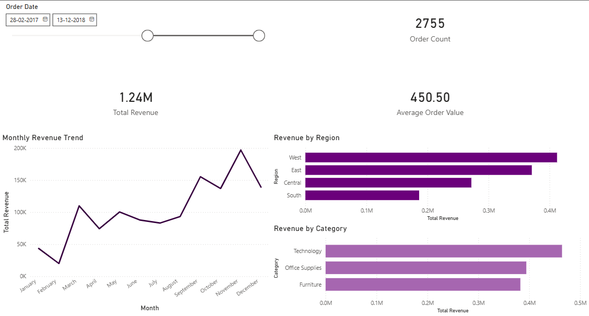

# Business Performance & Revenue Analytics

## Overview
This project presents an end-to-end analysis of business performance using
sales transaction data. The objective is to evaluate revenue trends, regional
performance, and customer/product contribution to support data-driven
business decisions.

## Data Source
Sales transaction dataset containing order, customer, product, and revenue
information. The dataset does not include cost or profit metrics.

## Key Analyses
- Revenue KPIs and overall performance
- Monthly revenue trend analysis
- Region-wise revenue contribution
- Product and customer revenue concentration
- Identification of data limitations and future improvement areas

## Tools & Technologies
- SQL (business KPI queries)
- Python (Pandas, Matplotlib)
- Jupyter Notebook
- GitHub

## Key Insights
- Revenue exhibits seasonal trends that can inform marketing and inventory planning.
- A small subset of regions, products, and customers contributes a significant
  share of total revenue.
- Absence of cost data limits profitability analysis; future work should
  integrate cost and margin metrics.

## Business Recommendations
- Focus on high-performing regions and customers for retention strategies.
- Optimize inventory and promotions based on seasonal demand patterns.
- Integrate cost data to enable margin and profitability analysis.
## Power BI Dashboard

An interactive Power BI dashboard built to analyze business performance.

**Features:**
- KPI cards: Total Revenue, Order Count, Average Order Value
- Monthly revenue trend analysis
- Region-wise and category-wise revenue breakdown
- Date slicer for interactive filtering

